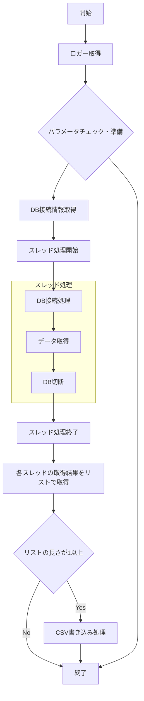

## 課題：高負荷対応「近傍施設検索エンジン」の構築 (Python版)

### 1. システム要件

#### A. データベース設計

以下のカラムを持つ `stores` テーブルを作成してください。

- `id`: シリアル型（主キー）
- `name`: 文字列（店舗名）
- `category`: 文字列（カテゴリ：例 `restaurant`, `cafe`, `shop`）
- `geom`: `GEOMETRY(Point, 4326)` 型
- **必須:** `geom` カラムに GIST インデックスを貼ること。

#### B. 大量データ生成と高速インサート

- **10万件**のランダムなデータを生成し、データベースに登録してください。
- **要件:** 1件ずつ `INSERT` するのではなく、`psycopg2` の `execute_values` や `copy_from` 等を使用して、**バルクインサート**を実装してください。
- インサートにかかった時間を計測し、表示してください。

#### C. 検索ロジック（PostGIS最適化）

- 特定の座標から半径 `N` メートル以内の店舗を検索する関数を作成します。
- **要件:** `ST_Expand` と `&&` 演算子（バウンディングボックス検索）を組み合わせて、インデックスを確実に活用するクエリを書くこと。
- ヒント：`WHERE geom && ST_Expand(center, distance) AND ST_Distance(...) < distance`

#### D. マルチスレッドによる負荷シミュレーション

- `ThreadPoolExecutor` を使用して、**「100個の異なる地点」**からの同時検索をシミュレーションしてください。
- **要件:**
  - 同時に実行する最大スレッド数を制御すること（例：`max_workers=10`）。
  - 100個のクエリがすべて完了するまでの総時間を計測すること。

#### E. パフォーマンス分析

- 各クエリの結果件数と、全体の平均処理時間を表示してください。

---

### 2. 方針

対応は以下の３つに分ける

- A. データベース設計
- B. 大量データ生成と高速インサート
- C~E. 検索ロジック（PostGIS最適化） / マルチスレッドによる負荷シミュレーション / パフォーマンス分析

---

### 3. 設計

#### 3-1. データベース設計

- CREATE TABLEでデータベースを作成
- テーブル名はstores
- NULLは許可しない
- カラムの条件
  - `id`: シリアル型（主キー）
  - `name`: 文字列（店舗名）
  - `category`: 文字列（カテゴリ：`restaurant`, `cafe`, `market`, `Bakery`, `Bar`, `C-store`）
  - `geom`: `GEOMETRY(Point, 4326)` 型
  - **必須:** `geom` カラムに GIST インデックスを貼ること。

```sql
CREATE TABLE stores (
    id SERIAL PRIMARY KEY,
    name VARCHAR(255) NOT NULL,
    category VARCHAR(255) NOT NULL CHECK (category IN ('restaurant', 'cafe', 'market', 'Bakery', 'Bar', 'C-store')),
    geom GEOMETRY(Point, 4326) NOT NULL
);
CREATE INDEX idx_stores_geom ON stores USING GIST(geom);
```

- カテゴリを追加する場合

```sql
-- 1. 古いチェック制約を削除
ALTER TABLE stores DROP CONSTRAINT stores_category_check;
-- 2. 新しいカテゴリ(`Set-Meal-shop`)を追加した制約を再設定
ALTER TABLE stores ADD CONSTRAINT stores_category_check CHECK (category IN ('Restaurant', 'Cafe', 'Market', 'Bakery', 'Bar', 'C-store', 'Set-Meal-shop'));
```

- インデックスを削除する場合(INSERT前に削除した方が高速なため)

```sql
-- 1. インデックスの削除
DROP INDEX IF EXISTS idx_stores_geom;

-- 2. インデックスの追加と統計情報の更新
CREATE INDEX idx_stores_geom ON stores USING GIST(geom);
ANALYZE stores;

-- 3. idカラムのSERIALが1のままなので更新
SELECT setval(pg_get_serial_sequence('stores', 'id'), COALESCE(max(id), 1)) FROM stores;
```

---

#### 3-2. 大量データ生成と高速インサート

##### 要件の理解

- **要件:** 1件ずつ `INSERT` するのではなく、`psycopg2` の `execute_values` や `copy_from` 等を使用して、**バルクインサート**を実装してください。
  - `python` の `psycopg2` モジュールを利用する形はNW通信の分時間がかかるので `INSERT INTO stores (id ,name, category, geom) SELECT ...略...;` の形にする
  - idはSELECTで取得し、その後にserialを更新
  - nameは店舗名のパーツを配列で定義してランダムで作成
    - 接頭辞リスト: ['ミント', 'ハッピー', 'サンライズ', 'ゴールデン', 'ラッキー', 'スペシャル', '気まぐれ', '毎日', '爽やか', 'everyday']
    - 接尾辞リスト: ['レストラン', 'カフェ', 'スーパー', 'ベーカリー', '居酒屋', 'コンビニ', '定食']
    - この組み合わせでは`10 × 6 = 60`通りしか表現できないため、ユニークな名称にするために`id + 号店`という文字列を後ろに加える
  - geomはデータが陸上に指定されるように、以下の都市の付近で傾斜をつけて生成する
    - 1. 都市の代表点を決める
    - 2. ランダムで地点を生成する範囲を決める
    - 3. 都市ごとのデータの傾斜を決める
      - 1. 川越(埼玉県)(35.92, 139.48), 奈良(奈良県)(34.68 ,135.99), 岐阜(岐阜県)(35.41, 136.76), 富良野(北海道)(43.30, 142.42), 日田(大分県)(33.32, 130.94)
      - 2. 半径40km 緯度: `80km / 111km(緯度1度) ≒ 0.7` 経度: `80km / 91km(北緯35度付近の経度1度) ≒ 0.9`
      - 3. 川越 50%, 奈良 20%, 岐阜 10%, 富良野 10%, 日田 10%

- インサートにかかった時間を計測し、表示してください。
  - DO文(`DO $$ END $$`)を使って時間を計測する
  - 追加で100万件までは性能が劣化しないことを確認した

- SERIALを使っていないため、idカラムのSERIALを更新した場合は、テーブル削除の際に`RESTART IDENTITY`をつける
  ```
  TRUNCATE TABLE stores RESTART IDENTITY;
  ```

```sql
DO $$
DECLARE
    total_records INT := 1000000; -- 生成するデータ数を指定
    prefixes TEXT[] := ARRAY['ミント', 'ハッピー', 'サンライズ', 'ゴールデン', 'ラッキー', 'スペシャル', '気まぐれ', '毎日', '爽やか', 'everyday'];
    suffixes TEXT[] := ARRAY['レストラン', 'カフェ', 'スーパー', 'ベーカリー', '居酒屋', 'コンビニ'];
    categories TEXT[] := ARRAY['restaurant', 'cafe', 'market', 'Bakery', 'Bar', 'C-store'];
    base_longitudes DOUBLE PRECISION[] := ARRAY[139.48, 135.99, 136.76, 142.42, 130.94];
    base_base_latitudes DOUBLE PRECISION[] := ARRAY[35.92, 34.68 , 35.41, 43.30, 33.32];
    start_time TIMESTAMP := clock_timestamp();

BEGIN
    INSERT INTO stores (id, name, category, geom)
    WITH store_source AS (
        SELECT
            s,
            prefixes_idx,
            suffix_idx,
            CASE
                WHEN prefixes_idx <= 5 THEN 1
                WHEN prefixes_idx <= 7 THEN 2
                WHEN prefixes_idx = 8 THEN 3
                WHEN prefixes_idx = 9 THEN 4
                ELSE 5
            END AS city_idx
        FROM (
            SELECT
                s,
                floor(random() * 10 + 1)::int AS prefixes_idx,
                floor(random() * 6 + 1)::int AS suffix_idx
            FROM generate_series(1,total_records) AS s) AS random_indexes
    )
    SELECT
        s AS id,
        prefixes[prefixes_idx] || suffixes[suffix_idx] || ' ' || s || '号店' AS name,
        categories[suffix_idx] AS category,
        ST_SetSRID(ST_MakePoint(base_longitudes[city_idx] + (random() - 0.5) * 0.9,  base_base_latitudes[city_idx] + (random() - 0.5) * 0.7), 4326) AS geom -- 80kmは経度は0.9度, 緯度は0.7度
    FROM store_source;

    RAISE NOTICE 'actual time: %', clock_timestamp() - start_time;
END $$;
```

---

#### 3-3. 検索ロジック（PostGIS最適化） / マルチスレッドによる負荷シミュレーショ / パフォーマンス分析

##### 3-3-1. 要件の理解 ---- 検索ロジック（PostGIS最適化） ----

- 特定の座標から半径 `N` メートル以内の店舗を検索する関数を作成します。
- **要件:** `ST_Expand` と `&&` 演算子（バウンディングボックス検索）を組み合わせて、インデックスを確実に活用するクエリを書くこと。

- クエリ検討
  - 取得するカラムは`id`, `name`, `category`, `geom`
  - ここでは仮の地点(東京都新宿区 `(35.92, 139.48)`)と仮の距離(`1000m`)でクエリを作成
  - インデックスを使うために特定の座標から少し大きめの範囲(`1.5倍程度`)の`geometry`を取得 `ST_Expand()`
  - 取得した`geometry`に対して`BBOX`を使って絞り込みを行う `geom $$ ST_Expand()`
  - 絞り込んだ上で正確にメートルで絞り込み `ST_Dwithin()`

- 検索ロジック設計
  - 検索手法
    - インデックスを最大限活用するため、「荒いフィルタリング(`BBOX`)」と「精密なフィルタリング(距離計算)」の二段階評価を行う
  - ステップ１: 荒いフィルタリング(`BBOX`)
    - `ST_Expand()`を用いて、特定の座標を中心として指定距離をカバーする`BBOX`を作成
    - `&&`演算子によりインデックスを用いて候補レコードを高速に抽出する
    - `ST_Expand`に与える「度」の引数は、指定メートル / 111000（緯度1度あたりの距離）を基準に、マージン（1.5倍等）を考慮して算出する
      - `1000m`の場合は `1000 / 111000 * 1.5 ≒ 0.014`
      - [補足]
        - 緯度`1`度はどこでも約`111`km
        - 経度1度は高緯度ほど短くなる(北緯`20`度:経度`1`度は約`104km`/北緯`45`度:経度`1`度は約約`78km`)
        - 最北端を基準とした場合、最南端をカバーするためには`104/78=1.33`なので`1.5`倍のバッファを持てば取りこぼしがなくなるはず
  - ステップ２: 精密なフィルタリング(距離計算)
    - ステップ１で絞り込まれたレコードに対して、ST_DWithin()を適用
    - 引数はgeograhpy型にキャストし、メートル単位で正確に判定を行う

```sql
SELECT
    id, name, category, ST_AsText(geom)
FROM stores
WHERE geom && ST_Expand(ST_SetSRID(ST_MakePoint(139.48,35.92),4326), 0.014) -- 東京都新宿区から約1.55kmにある地点を絞り込み
AND ST_DWithin(ST_SetSRID(ST_MakePoint(139.48,35.92),4326)::geography, geom::geography, 1000) -- 1000m以内の地点を正確に計算
;
```

##### 3-3-2. 要件の理解 ---- マルチスレッドによる負荷シミュレーション ----

- `ThreadPoolExecutor` を使用して、**「100個の異なる地点」**からの同時検索をシミュレーションしてください。
- **要件:**
  - 同時に実行する最大スレッド数を制御すること（例：`max_workers=10`）。
  - 100個のクエリがすべて完了するまでの総時間を計測すること。

- まずは１個の地点から検索をするための設計を行う
  - ロギング
  - バリデーション
    - 地点が国内か(型チェック(float型)/緯度経度が国内の数値)
    - 距離の型チェック(int型)
    - 距離を度で計算する際の係数の型チェック(float型)
    - CSV保存先のディレクトリのパスが存在するかチェック
  - DB接続処理
    - DB接続情報取得処理
  - データ取得処理
    - 取得したデータの扱いはどうする？(CSVに書き込む)
    - 実行結果はリストで取得
  - CSV書き込み処理
    - 引数でリストとファイルパスを受け取り、書き込む
    - 実行結果が０件の時は実行しない

- フローチャート



---

##### 3-3-3 関数検討

- 3-3-3-1. ロガー取得
  - 概要:
    - ロガーの設定を行う
  - 関数名:
    - `setup_logger()`
  - INPUT:
    - ログファイルを格納するディレクトリパス
      - モジュールと同じ階層の`logs`直下に保存
  - PROCESS:
    - ターミナルとファイルへログを表示
    - デェフォルトのレベルはdebug
    - 使用するログレコードは以下
      - 時間 `%(asctime)s`
      - ロギングレベル `%(levelname)s`
      - スレッド名 `%(threadName)s`
      - ソースの行番号 `%(lineno)d`
      - ログメッセージ `%(message)s`
  - OUTPUT
    - なし

- 3-3-3-2. パラメータチェック
  - 概要:
    - ツールの中で使うパラメータのバリデーションや計算を行う
    - 対象の変数は以下
      - 基準地点(型チェック(float型)/緯度経度が国内の数値)
        - TARGET_POINTS
      - 検索距離(型チェック(int型))
        - SEARCH_RADIUS_M
      - 検索距離(度)(型チェック(float型))
        - search_radius_padding_factor
      - スレッド数(int型)
        - MAX_WORKERS
      - CSV保存先のディレクトリのパス(ツールと同階層のresultディレクトリとし、resultディレクトリがあることを確認)
        - output_dir
  - 関数名:
    - `validate_params()`
  - INPUT:
    - 対象の変数
  - PROCESS:
    - `TARGET_POINTS`:
      - 型チェック(float型)
      - 緯度の範囲が`20.4` ~ `45.6`であること
      - 軽度の範囲が`122.9` ~ `154.0`であること
      - 上記を満たさない場合はメッセージを表示しツール終了
    - `SEARCH_RADIUS_M`:
      - 型チェック(int型)
      - 範囲が`1` ~ `9999`(`0m`より大きく`10,000m`未満)であること
        - 要件には明記されないが、範囲が広くなると対象が多くなり性能の劣化につながるため仮設定。現在対象データは10万件なのでその増加に合わせて範囲も見直す
      - 上記を満たさない場合はメッセージを表示しツール終了
    - `search_radius_padding_factor`:
      - 計算式: `SEARCH_RADIUS_M / 111000 * 1.5`
      - `SEARCH_RADIUS_M / 111000`: 単位変換(メートル→度)
      - `* 1.5`: 1段階目の絞り込みの対象となる四角形を作るためには`1.41`倍が必要 / 最南端・最北端の差`1.42`倍を考慮した倍率
      - 上記を満たさない場合はメッセージを表示しツール終了
    - MAX_WORKERS:
      - 型チェック(int型)
      - 上記を満たさない場合はメッセージを表示しツール終了
    - output_dir:
      - ツールと同階層に`result`ディレクトリが存在することを確認
      - 上記を満たさない場合はメッセージを表示しツール終了
  - OUTPUT:
    - なし

- 3-3-3-3. DB接続情報取得
  - 概要:
    - .envファイルの環境変数を読み込み辞書型に整形し返す
    - .envの読み込みには`dotenv`モジュールの`load_dotenv()`を使用
    - 読み込んだ値は`os`モジュールの`get_env()`で取得
  - 関数名:
    - `get_db_config()`
  - INPUT:
    - なし
  - PROCESS:
    - 以下のキーで値を保持
      - `host`,`port`, `database`, `user`, `pass`
  - OUTPUT:
    - 整形した辞書
