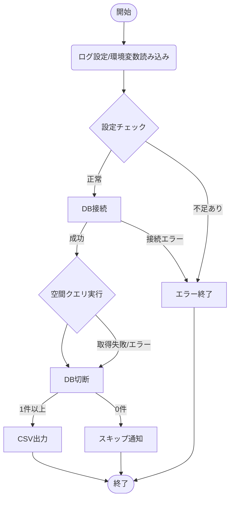

# PostGIS データ抽出プロジェクト

## 1. ディレクトリ構造

プロジェクト全体の構成は以下の通り。

```text
.
├── .env                            # DB接続情報、機密情報（ルート直下）
├── tr_postgis/                     # プログラム本体
│       ├── README.md               # プロジェクトの概要説明
│       ├── config.py               # 設定管理・ロギング
│       ├── sample_postgis_1.py     # メインロジック
│       ├── tests/                  # ユニットテスト
│       │    ├── __init__.py
│       │    ├── test_config.py
│       │    └── test_sample_postgis.py
│       ├── result/                 # 実行結果(取得ファイル)出力先
│       │    └── extraction_point.csv
│       └── log/                    # 実行ログ出力先
```

---

## 2. モジュール定義

各モジュールの責務と提供する主要関数。

### 2.1 tr_postgis/config.py

| 関数名            | 引数 | 戻り値 | 説明                                               |
| :---------------- | :--- | :----- | :------------------------------------------------- |
| `setup_logging()` | なし | なし   | ログフォルダの作成と初期設定を行う。               |
| `get_db_config()` | なし | `dict` | `.env` から情報を取得。不足があれば `SystemExit`。 |

### 2.2 tr_postgis/sample_postgis_1.py

#### 2.2.1 PostGISProcessor クラス

| メソッド名                      | 引数                                    | 戻り値 | 説明                                                                       |
| :------------------------------ | :-------------------------------------- | :----- | :------------------------------------------------------------------------- |
| `__init__`                      | `dict, tuple, int/str, float/str, Path` | なし   | 設定値の注入（DI）と初期化。                                               |
| `validate_target_point()`       | なし                                    | なし   | 基準点のバリデーション（日本国内か）とWKT変換。不備があれば `ValueError`。 |
| `validate_execution_settings()` | なし                                    | なし   | 検索距離・係数の型変換と正数チェック。不備があれば `ValueError`。          |
| `connect_db()`                  | なし                                    | `conn` | DB接続を確立。`self.conn` に保持。                                         |
| `fetch_data_from_db()`          | なし                                    | なし   | 空間クエリを実行。結果を `self.fetch_rows` に格納。                        |
| `run()`                         | なし                                    | `bool` | 上記メソッドを統括。バリデーション・接続・実行・保存・切断を制御。         |

#### 2.2.2 save_to_csv()

| メソッド名      | 引数                 | 戻り値 | 説明                        |
| :-------------- | :------------------- | :----- | :-------------------------- |
| `save_to_csv()` | `str`/`Path`, `list` | なし   | クエリの取得結果をCSV保存。 |

---

## 3. 処理フロー

本プログラムの実行フローは以下の通り。



---

## 4. テスト仕様

`pytest` による検証観点を定義する。

### 4.1 config.py 検証

---

### 4.2 sample_postgis_1.py 検証

### 4.2.1 connect_db() 検証 (ID: SC-XXX)

| ID    | 分類 | テスト項目（観点）                                      | 期待される結果                                                                       |
| :---- | :--- | :------------------------------------------------------ | :----------------------------------------------------------------------------------- |
| SC-N1 | 正常 | 正しい設定で接続が成功し、ログが出力されること          | ・psycopg2の接続オブジェクトが返されること<br>・INFOログに「DB接続」と出力されること |
| SC-E1 | 異常 | 接続失敗時に `psycopg2.OperationalError` が発生すること | ・`psycopg2.OperationalError` がスローされること                                     |

### 4.2.2 fetch_data_from_db (ID: SF-XXX)

| ID    | 分類 | テスト項目（観点）                                                                 | 期待される結果                                                                               |
| :---- | :--- | :--------------------------------------------------------------------------------- | :------------------------------------------------------------------------------------------- |
| SF-N1 | 正常 | クエリ実行によりデータが取得（1件以上）できること                                  | ・インスタンス変数`fetch_rows`の長さが1となること                                            |
| SF-N2 | 正常 | 条件に合うデータがない場合、空リストが返ること                                     | ・インスタンス変数`fetch_rows`が `[]` となっていること（例外が発生しないこと）               |
| SF-E1 | 異常 | SQLエラー（カラム名間違い等）で `ProgrammingError` が発生すること                  | ・`psycopg2.ProgrammingError` がスローされること                                             |
| SF-E2 | 異常 | 接続が失敗している状態でのクエリ実行（ガード節確認） `RuntimeError` が発生すること | ・`RuntimeError` がスローされること<br>ログに`DB接続が確立されていません。` と出力されること |

### 4.2.3 validate_target_point (ID: SV-XXX)

| ID    | 分類 | テスト項目（観点）                           | 期待される結果                                                                                            |
| :---- | :--- | :------------------------------------------- | :-------------------------------------------------------------------------------------------------------- |
| SV-N1 | 正常 | 基準点が正しく解析されること                 | ・インスタンス変数 `point_wkt` に WKT形式（POINT(経度 緯度)）がセットされること                           |
| SV-N2 | 正常 | 境界値の点も基準点が正しく解析されること     | ・境界値（20.0や154.0など）を含んだWKT形式の文字列が正しく生成されること                                  |
| SV-E1 | 異常 | 緯度が範囲外の場合、ValueErrorが発生すること | ・`ValueError` がスローされること<br>・ログに「【設定値エラー】基準点は北緯20°〜45°...」と出力されること` |
| SV-E2 | 異常 | 経度が範囲外の場合、ValueErrorが発生すること | ・`ValueError` がスローされること<br>・ログに「【設定値エラー】基準点は北緯20°〜45°...」と出力されること` |

### 4.2.4 validate_execution_settings (ID: SVE-XXX)

| ID     | 分類 | テスト項目（観点）                                 | 期待される結果                                                                                     |
| :----- | :--- | :------------------------------------------------- | :------------------------------------------------------------------------------------------------- |
| SVE-N1 | 正常 | 正しい数値（int/float）が設定されている            | ・インスタンス変数 `search_radius`に整数型, `coefficient`に浮動小数型で値がセットされること        |
| SVE-N2 | 正常 | 数字の文字列（"100"等）が設定されている            | ・インスタンス変数 `search_radius`に整数型, `coefficient`に浮動小数型で値がセットされること        |
| SVE-E1 | 異常 | 負の数値が設定されている                           | ・`ValueError` がスローされること<br>・ログに「SEARCH_RADIUSは正の整数...」と出力されること        |
| SVE-E2 | 異常 | 0 （文字列含む）が設定されている                   | ・`ValueError` がスローされること<br>・ログに「...COEFFICIENTは正の浮動小数で...」と出力されること |
| SVE-E3 | 異常 | 数値に変換できない文字列（"st"等）が設定されている | ・`ValueError` がスローされること<br>・ログに「SEARCH_RADIUSは正の整数...」と出力されること        |
| SVE-E4 | 異常 | 変換不可能な型（list等）が設定されている           | ・`ValueError` がスローされること<br>・ログに「...COEFFICIENTは正の浮動小数で...」と出力されること |

### 4.2.5 run (ID: SR-XXX)

| ID    | 分類 | テスト項目（観点）             | 期待される結果                                                                                                                                                                                |
| :---- | :--- | :----------------------------- | :-------------------------------------------------------------------------------------------------------------------------------------------------------------------------------------------- | --- | ----- | ---- | ------------------ | ------------------------------------------------------------------------------------------------------------------------------------------------- |
| SR-N1 | 正常 | 正常ルート（データあり）の確認 | ・戻り値が`True`となること<br>・`fetch_data_from_db()` が一度だけ実行されること                                                                                                               |
| SR-N2 | 正常 | 正常ルート（データなし）の確認 | ・戻り値が`True`となること<br>・CSV出力処理が呼ばれないこと<br>・ログに「取得結果が0件のためCSVファイルの出力をスキップ」が出力されること<br>・`fetch_data_from_db()`が一度だけ実行されること |
| SR-E1 | 異常 | DB接続失敗時の確認             | ・戻り値が`False`となること<br>・ERRORログに「【DB接続エラー】...」が出力されること<br>・`fetch_data_from_db()` が実行されないこと                                                            |
| SR-E2 | 異常 | SQL実行エラー発生時の確認      | ・戻り値が`False`となること<br>・ERRORログに「【SQL実行エラー】...」が出力されること<br>・`fetch_data_from_db()` が一度だけ実行されること                                                     |
| SR-E3 | 異常 | その他DBエラー発生時の確認     | ・戻り値が`False`となること<br>・ERRORログに「【その他DBエラー】...」が出力されること<br>・`fetch_data_from_db()` が一度だけ実行されること                                                    |     | SR-E1 | 異常 | DB接続失敗時の確認 | ・戻り値が`False`となること<br>・ERRORログに「【設定値エラー】...」が出力されること<br>・`connect_db()` `fetch_data_from_db()` が実行されないこと |

### 4.2.6 main() 検証 (ID: SM-XXX)

| ID    | 分類 | テスト項目（観点）                               | 期待される結果                                     |
| :---- | :--- | :----------------------------------------------- | :------------------------------------------------- |
| SC-N1 | 正常 | 例外が発生することなく処理が完了するケースの確認 | ・INFOログに「---- 正常終了 ----」と出力されること |
| SC-N2 | 異常 | 途中で例外が発生して処理が完了するケースの確認   | ・INFOログに「---- 異常終了 ----」と出力されること |

---

### 4.2.7 save_to_csv (ID: SS-XXX)

| ID    | 分類 | テスト項目（観点）                              | 期待される結果                                                                                                                                                                                                             |
| :---- | :--- | :---------------------------------------------- | :------------------------------------------------------------------------------------------------------------------------------------------------------------------------------------------------------------------------- |
| SS-N1 | 正常 | リストデータが正しくCSVに書き込まれること       | ・指定したパスにファイルが作成されること<br>・1行目がヘッダー（id, geom）であること<br>・引数で渡したリストの内容とファイル内容が一致すること<br>・INFOログに「〇件 のデータをファイルに書き込みました。」と出力されること |
| SS-E1 | 異常 | 書き込み権限がない等で `OSError` が発生すること | ・`OSError`（または `PermissionError` 等）がスローされること                                                                                                                                                               |

### テスト実行方法

`tr_postgis` ディレクトリに移動し、以下のコマンドを実行する。

```bash
cd tr_postgis
pytest
```
