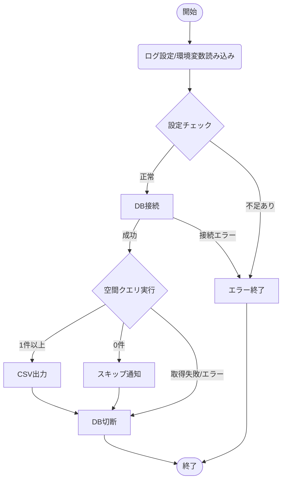

# PostGIS データ抽出プロジェクト

## 1. ディレクトリ構造

プロジェクト全体の構成は以下の通り。

```text
.
├── .env                            # DB接続情報、機密情報（ルート直下）
├── tr_postgis/                     # プログラム本体
│       ├── README.md               # プロジェクトの概要説明
│       ├── config.py               # 設定管理・ロギング
│       ├── sample_postgis_1.py     # メインロジック
│       ├── tests/                  # ユニットテスト
│       │    ├── __init__.py
│       │    ├── test_config.py
│       │    └── test_sample_postgis.py
│       ├── result/                 # 実行結果(取得ファイル)出力先
│       │    └── extraction_point.csv
│       └── log/                    # 実行ログ出力先
```

---

## 2. モジュール定義

各モジュールの責務と提供する主要関数。

### tr_postgis/config.py

| 関数名            | 引数 | 戻り値 | 説明                                               |
| :---------------- | :--- | :----- | :------------------------------------------------- |
| `setup_logging()` | なし | なし   | ログフォルダの作成と初期設定を行う。               |
| `get_db_config()` | なし | `dict` | `.env` から情報を取得。不足があれば `SystemExit`。 |

### tr_postgis/sample_postgis_1.py

| 関数名                 | 引数        | 戻り値 | 説明                                   |
| :--------------------- | :---------- | :----- | :------------------------------------- |
| `connect_db()`         | `dict`      | `conn` | PostgreSQL(PostGIS)への接続を確立。    |
| `fetch_data_from_db()` | `conn, str` | `list` | 空間検索クエリを実行。                 |
| `save_to_csv()`        | `str, list` | なし   | 結果をCSV保存。0件時は保存をスキップ。 |
| `main()`               | なし        | なし   | メイン処理。                           |

---

## 3. 処理フロー

本プログラムの実行フローは以下の通り。



---

## 4. テスト仕様

`pytest` による検証観点を定義する。

### 4.1 config.py 検証

---

### 4.2.1 connect_db() 検証 (ID: SC-XXX)

| ID    | 分類 | テスト項目（観点）                                      | 期待される結果                                                                           |
| :---- | :--- | :------------------------------------------------------ | :--------------------------------------------------------------------------------------- |
| SC-N1 | 正常 | 正しい設定で接続が成功し、ログが出力されること          | ・psycopg2の接続オブジェクトが返されること<br>・INFOログに「DB接続」と出力されること     |
| SC-E1 | 異常 | 接続失敗時に `psycopg2.OperationalError` が発生すること | ・`psycopg2.OperationalError` がスローされること<br>・「DB接続」のログが出力されないこと |

### 4.2.2 fetch_data_from_db (ID: SF-XXX)

| ID    | 分類 | テスト項目（観点）                                                | 期待される結果                                                                                                          |
| :---- | :--- | :---------------------------------------------------------------- | :---------------------------------------------------------------------------------------------------------------------- |
| SF-N1 | 正常 | クエリ実行によりデータが取得（1件以上）できること                 | ・取得結果が格納されたタプルのリスト（例: `[(id, geom), ...]`）が返ること<br>・DEBUGログに実行されたSQLが出力されること |
| SF-N2 | 正常 | 条件に合うデータがない場合、空リストが返ること                    | ・空のリスト `[]` が返ること（例外が発生しないこと）                                                                    |
| SF-E1 | 異常 | SQLエラー（カラム名間違い等）で `ProgrammingError` が発生すること | ・`psycopg2.ProgrammingError` がスローされること                                                                        |

### 4.2.3 save_to_csv (ID: SS-XXX)

| ID    | 分類 | テスト項目（観点）                              | 期待される結果                                                                                                                                                                                                             |
| :---- | :--- | :---------------------------------------------- | :------------------------------------------------------------------------------------------------------------------------------------------------------------------------------------------------------------------------- |
| SS-N1 | 正常 | リストデータが正しくCSVに書き込まれること       | ・指定したパスにファイルが作成されること<br>・1行目がヘッダー（id, geom）であること<br>・引数で渡したリストの内容とファイル内容が一致すること<br>・INFOログに「〇件 のデータをファイルに書き込みました。」と出力されること |
| SS-E1 | 異常 | 書き込み権限がない等で `OSError` が発生すること | ・`OSError`（または `PermissionError` 等）がスローされること                                                                                                                                                               |

### 4.2.4 main (ID: SM-XXX)

| ID    | 分類 | テスト項目（観点）                                             | 期待される結果                                                                                                                 |
| :---- | :--- | :------------------------------------------------------------- | :----------------------------------------------------------------------------------------------------------------------------- |
| SM-N1 | 正常 | 正常ルート（データあり）: 接続→取得→保存→切断 が完結すること   | ・CSVファイルが出力されること<br>・ログに「DB接続」「〇件...書き込みました」「DB切断」が順に出力されること                     |
| SM-N2 | 正常 | 正常ルート（データなし）: 接続→取得→スキップ→切断 となること   | ・CSV出力処理が呼ばれないこと<br>・ログに「取得結果が0件のためCSVファイルの出力をスキップ」「DB切断」が出力されること          |
| SM-E1 | 異常 | DB接続情報の値にNoneがある場合、プログラムを異常終了すること   | ・ERRORログに「【設定エラー】以下の環境変数が空です:　...」が出力されること<br>・プログラムが異常終了（ステータス:1）すること  |
| SM-E2 | 異常 | `OperationalError` 発生時、適切にログ出力して終了すること      | ・ERRORログに「【DB接続エラー】設定を見直してください。...」が出力されること<br>・プログラムが異常終了（クラッシュ）しないこと |
| SM-E3 | 異常 | `ProgrammingError` 発生時、適切にログ出力して終了すること      | ・ERRORログに「【SQL実行エラー】クエリの内容を確認してください。...」が出力されること<br>・「DB切断」ログが出力されること      |
| SM-E4 | 異常 | その他 `psycopg2.Error` 発生時、適切にログ出力して終了すること | ・ERRORログに「【その他DBエラー】:...」が出力されること<br>・「DB切断」ログが出力されること                                    |

---

### テスト実行方法

`tr_postgis` ディレクトリに移動し、以下のコマンドを実行する。

```bash
cd tr_postgis
pytest
```
